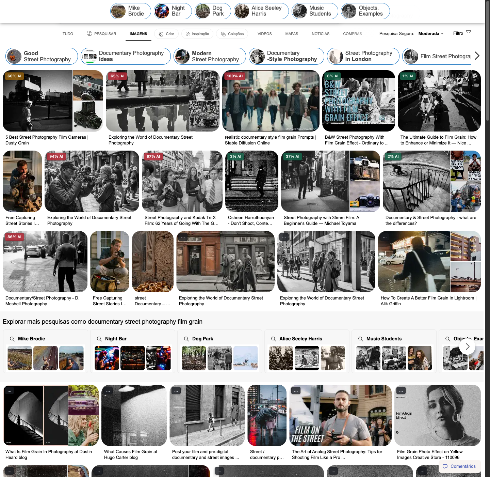

# Local AI Image Detector

A Chrome extension that scores the images on any page for being AI-generated.
Every part of the detection runs inside the browser. No image, no derived
feature, and no page URL is ever sent anywhere.

Install it, browse normally, and each image large enough to matter gets a small
badge with a confidence score.

## How it works

Three ONNX graphs run in sequence inside a single offscreen document:

```
image bytes
   |
   |  centre-square crop (integer, in host code)
   v
preprocess.onnx    uint8 [1,H,W,3]  ->  float32 [1,3,224,224]
   |                                    resize + normalize
   v
vision_model.onnx  CLIP ViT-B/32, frozen  ->  512-d embedding
   |
   |  L2 normalize
   v
head.onnx          trained classifier  ->  one logit
   |
   |  calibration  ->  confidence in [0,1]
   v
   fused with the file's own metadata  ->  verdict
```

**The backbone is frozen and the head is small.** The head is trained on
embeddings from a fixed CLIP image encoder rather than by fine-tuning the whole
network. Fine-tuning scores higher on the generators it was trained on and
worse on everything else, because it learns each generator's fingerprint
instead of what synthetic images have in common. Since the generators a user
will actually meet are mostly ones the training never saw, generalizing across
generators is worth more than peak in-distribution accuracy.

**Resizing happens inside ONNX, not in JavaScript.** Canvas resampling and PIL
resampling do not agree. If the browser resized images itself, it would feed
the head slightly different features from the ones it was trained on, and the
detector would quietly lose accuracy in a way no offline test could see.
Putting resize and normalization inside a graph that both sides run removes the
possibility instead of testing for it. `npm run parity` asserts it stays true.

**The confidence is calibrated so that 0.65 is the decision point.** The head's
raw output is mapped through a monotonic function fitted so that the threshold
which maximizes balanced accuracy lands exactly on 0.65. The badge flags at the
same 0.65, so what the extension shows and what the classifier considers its
best boundary are the same number.

**Metadata is used asymmetrically.** An embedded generation tag (an
Automatic1111 `parameters` chunk, a ComfyUI workflow, a C2PA manifest, a
generator named in EXIF `Software`) is near-proof and overrides the model
toward AI. Camera EXIF is weak evidence, since it is trivially forged and often
added by re-saving, so it only nudges and is bounded so it can never flip a
confident AI verdict. Calling a real photograph AI-generated is the more
damaging mistake, so only one direction gets an override.

## Requirements

- Google Chrome 116 or newer
- Node.js 20 or newer, to build

## Build

```bash
git clone <repository-url>
cd ai-image-detector
npm ci
npm run build
```

`npm run build` writes `dist/`. It copies the extension sources, the trained
head and its calibration, and the preprocessing graph; downloads the CLIP
backbone once and verifies it against a SHA-256 pinned in
`scripts/assets.json`; and vendors ONNX Runtime Web out of the locked
`node_modules`. A checksum mismatch fails the build rather than shipping
something other than what was measured.

This is the only step that touches the network. The extension itself never
does.

## Install

1. Open `chrome://extensions`
2. Turn on **Developer mode**
3. Click **Load unpacked**
4. Select the `dist/` directory

Visit any page with images. Badges appear on images at least 128 pixels on the
shorter side, as they scroll into view.

To confirm it runs offline: load the extension, then disconnect the network or
switch Chrome to offline in DevTools, and open a page with cached images. It
keeps scoring.

## Using it



- **Badges** show one number on every image: the probability it was
  AI-generated. Colour carries the verdict, so the number never changes
  meaning. Red is flagged at the current threshold, amber leans generated
  without crossing it, green does not. Hovering shows the exact confidence,
  the execution backend, and any metadata signal that contributed.
- **The toolbar popup** lists everything analyzed on the current tab, most
  suspicious first.
- **The options page** controls whether analysis runs, the flag threshold, the
  minimum image size, and whether badges appear on images judged real.

Moving the threshold away from 65% trades one kind of error for the other; the
model is calibrated for 65%.

## Evaluation

Measure balanced accuracy through the extension itself, in a real Chrome:

```bash
npm run build
node eval/run-benchmark.mjs --real path/to/real-images --ai path/to/ai-images
```

The harness loads the built extension, opens a page inside it, and calls the
same scoring function the browsing path calls. It reports balanced accuracy at
the threshold, the confusion matrix, a threshold sweep, and throughput.

Confirm the extension works end to end while browsing, badges and all:

```bash
npm run smoke
```

Check that the browser and the training pipeline still agree:

```bash
node eval/parity.mjs --images path/to/images
```

It holds each stage to the standard that stage can meet. Decode, crop and
preprocessing must match exactly, since both sides execute the same ONNX graph;
measured drift there is around 1e-7, which is float32 rounding. The backbone
embedding cannot match exactly, because the shipped model is int8 and
onnxruntime requantizes differently in its native and WebAssembly builds, so
that stage is bounded by cosine similarity (measured 0.983) instead. That
difference was measured to cost nothing: browser balanced accuracy came out
slightly above the Python figure on the same images.

Prove it needs no network. This puts Chrome offline before the extension loads
anything and refuses every request that is not a `chrome-extension:` URL:

```bash
npm run offline
```

Run the unit tests:

```bash
npm test
```

Or run the whole chain at once:

```bash
npm run verify
```

Measured results are in `docs/superpowers/reports/2026-08-15-browser-evaluation.md`.

## Training pipeline

The head shipped here was produced by the pipeline in `training/`, which is
included so the model is reproducible rather than a binary you have to trust.

```bash
python3.12 -m venv .venv
.venv/bin/pip install -r requirements.txt

.venv/bin/python -m training.cli fetch                       # assemble the image cache
.venv/bin/python -m training.cli extract clip-vit-b32-int8   # cache backbone features
.venv/bin/python -m training.cli train clip-vit-b32-int8     # fit head + calibration
```

Training data comes from publicly available datasets listed in
`training/datasets/sources.py`: real photographs spanning scenes, objects,
textures, faces and animals, and synthetic images from many generators. Some
generators are deliberately excluded from training and used only for
validation, because accuracy on a generator the model has already seen says
nothing about how it behaves on a new one.

Every image entering the cache passes through one re-encoding function
regardless of its class. Without that, one class could arrive as PNG and the
other as JPEG, and the head would learn the file format instead of the task.

Results and the reasoning behind the model choices are in
`docs/superpowers/reports/`.

## Privacy

- No network request is made by the extension at runtime, for any purpose.
- No image data, feature vector, URL, or usage signal leaves the device.
- No analytics, no telemetry, no remote configuration.
- The only bytes the extension reads are those of images already loaded on the
  page being viewed, fetched from the browser cache.

## Model provenance and licensing

The project is MIT licensed. Bundled weights and their upstream licenses are
recorded in `models/LICENSES.md`. The CLIP backbone is MIT; the trained head
and calibration are produced by this repository and are MIT.

## Limitations

Worth stating plainly:

- Accuracy is lower on GAN-era images than on modern diffusion and transformer
  models. Measured figures per generator are in
  `docs/superpowers/reports/2026-08-14-phase1-gate.md`.
- Heavy recompression, small crops and screenshots make any detector less
  reliable. Training includes those degradations, which helps, but does not
  eliminate the effect.
- A confidence score is a probability, not a verdict. Treat a high score as a
  reason to look closer, not as proof.
- Images below the size threshold, and images the browser cannot supply bytes
  for, are not analyzed.
